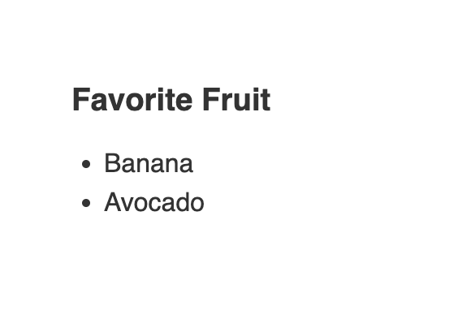
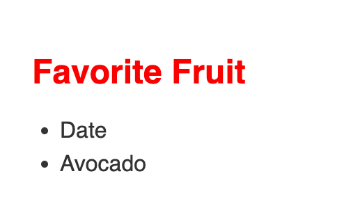

# cypress-recurse exercise app

It's a simple 'app' made strictly for practicing cypress-recurse.

The main purpose of this app is display a list of favorite fruits.



You will find that this app every 5 seconds will make a request (`localhost:7080/favorite-fruits`) to the local 'server' and an array with 2 fruits will be returned. When one of this fruits is a 'tomato', a 'favorite' class will be applied to `h1` element changing it's font size and color.



### install
```npm i```
### use
```npm start```

open: `localhost:7080`

---

original code (striped) can be in these repo: [cypress-example-recipes](https://github.com/cypress-io/cypress-example-recipes) -> in folder: `cypress-example-recipes/examples/stubbing-spying__intercept`
